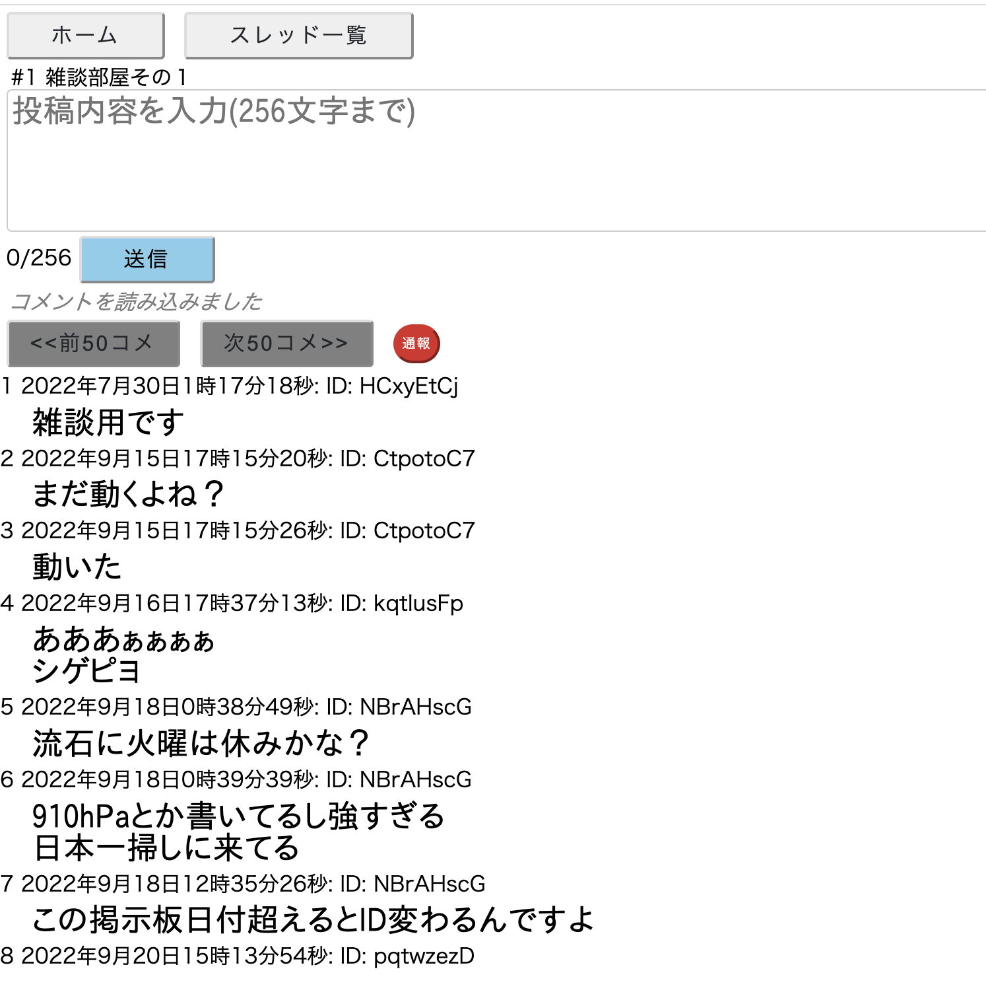
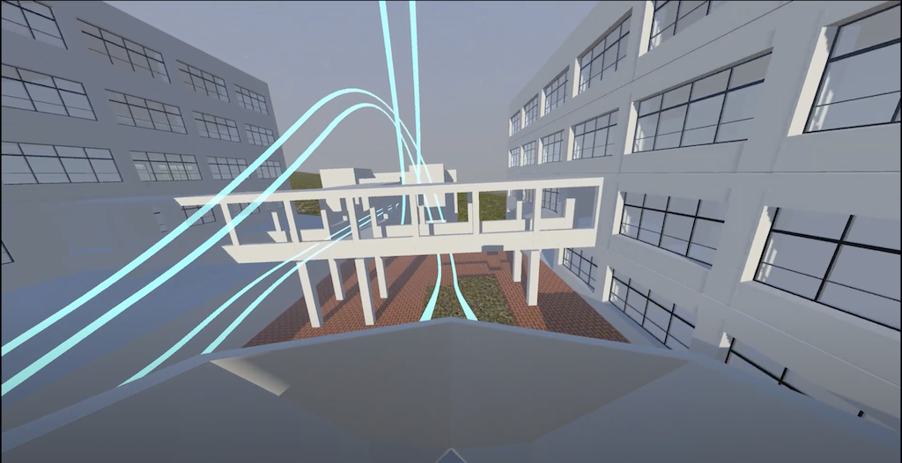
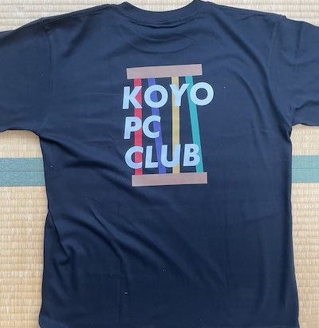
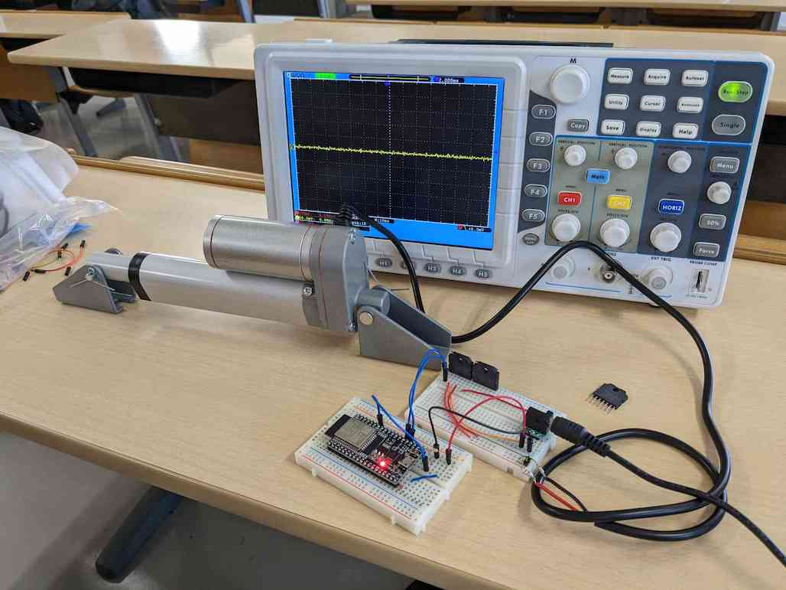

# PC部の沿革

>われわれは、三つの問題を立てることにしたい。  
>一 PC部とは何か？ ──全てである。 
>二 PC部は、これまで、甲陽においてどのようなものであったか。──無であった。 
>三 PC部は何を要求しているのか。──何がしかのものになることを。

形式 
・西暦 
・説明 

(105)というような表記は105回生がしたことを表す 
## 2019年

1月 
105回生の元部長K林君がバスケ部を辞める。 
K林君PC同好会を設立しようとするも中学で同好会の設立は認められていないという理由で却下される。 
K林くんPC同好会を設立。 
初期メンバーは五人で全員が中1だった。 

5月 
自由の学びの奨学金でパソコン一台を申請し審査に通った。 
~~結構スペックのいい物を無理して買っていただいた。~~ 

6月 
部員が増えて7人になった。(全員105回生) 
先述のパソコンが届いた。 

7月 
105回生は地理でケッペンの気候区分を習い、気候区分をパソコンに判定させるのが流行った。 
先に30を言った方が勝ちになるゲームを色々な言語で作った。 
五目並べ、オセロ、マイクラのmod、音展のホームページなどを作った。 

11月 
105回生初めての音展。

写真: 2019年の音展パンフレット(PC部作でない) 
2019年のテーマは「船出」で、中学では珍しい二文字だった。 
このパンフレットは逆から読むと「船出」が「甲陽」になるというすごいデザインとなっている。 
<table>
    <tr>
        <td></td>
        <td></td>
    </tr>
</table>

教室の半分を借り、プログラミング言語についてのポスター数枚、ホームページ、オセロ(コンピューターと対戦)を展示した。 
学校のホームページと同じサーバーに公開することを願い出たが生徒の写真があり問題だという理由で却下された。教室内のパソコン(奨学金でもらったもの)に表示することでホームページの展示をした。 
ホームページでは他の団体の展示の紹介や準備中の写真などを掲載した。 
[リンクはこちら](https://2019.koyo-onten.net/) 

写真: ホーム画面 

写真: PC同好会準備中の様子 
手前のパソコンでホームページ、オセロの展示をし、右側の仕切り板でポスターを展示した。 

オセロに関してはオセロ全国大会一位の子とそのお父様が来られて、ボコボコにされた。~~そんなに弱いとは思わないが...~~ 
[リンクはこちら](https://bjcodes.net:1140/othello.html) 

写真: 配布した部誌 

また、106回生が数名入部して部員は10人になった。 
音展後にボールを転がして迷路(自動生成)のゴールを目指すというゲームを作った。スマホを傾けると画面内で球が転がる仕組み。 

12月 
105回生はパソコンを自作したり、競技プログラミング(以下競プロ)を始めたりした。 

## 2020年

1月 
105回生は国語で漢文の返り点を学んだので、返り点から読み順を出力するプログラムを書いた。 

2月 
**新型コロナウイルスの影響で学校が休みになった** 
学年末考査が消滅した。 
休みが続きゲームにも飽きたので競プロに勤しむ部員が増え、競プロブームが起こった。 
学校が再開して忙しくなる7月まで続いた。 
105回生①AtCorder灰→茶 

3月 
105回生②AtCorder灰→茶 

5月 
[GitHub](https://github.com/)という、ファイルの変更履歴を保存できるサービスの勉強を始めた。 
オンライン授業で三角関数を習った。 
105回生①AtCorder茶→緑 
105回生②AtCorder茶→緑 

7月 
この頃まで登校後に物理準備室でパソコンを預かってもらっていたが、PC同好会専用ロッカーを買ってもらえることになった。 
PC同好会のロゴのデザインはこのロッカーの鍵や物理講義室の鍵が付けてあったオブジェが元になっている。 

写真: PC同好会ロゴ 

8月 
音展のために、中学校を360度カメラで撮影し、中学のストリートビューを作り始めた。three.jsというものを使った。 

10月 
ある部員がSVGからPNGに変換するプログラムを書いた。 
ストリートビュー作成のため長い廊下を通行止めにし、校内のあちこちを撮った。顔はもちろん人が写るのが許されていなかったためである。一部は画像編集で自然に消した。 

11月 
105回生2回目の音展。 

写真: 2020年の音展パンフレット 
2020年のテーマは「道」だった。写真の絵は部員のH君が描いた。 

この音展では展示スペースを設けず、学校のサーバーを借りてオンラインで発表した。 
[リンクはこちら](https://2020.koyo-onten.net/) 

写真: ホーム画面 

学校のサーバーだけに頼るのはデバッグが困難だった。 
ホームページやストリートビューを校内のQRコードからアクセスして見ていただいた。 

以下ストリートビューのリンク 
[地図画面へのリンク](https://2020.koyo-onten.net/Map.html) (地図上の青い四角を押して開始) 
[光庭へのリンク](https://2020.koyo-onten.net/Streetview.html?num=25) 

写真: 光庭での画面 

音展後にはマリオの1-1を自作したりUnityで音ゲーを作ったりした。 
## 2021年

2月 
先述のマリオが完成した。 
この頃部員は12名いた。 

3月 
105回生は全員高校へ進学となり、中学のPC同好会は実質消滅した。 

4月 
高校でPC同好会が再び設立された。 
部員は9人となった。 
複数の部員がパソコンを買い替えた。 

6月 
Vue.jsというものの学習を始めた。 
高校版のストリートビューを作り始めた。 

7月 
カメラを[Raspberry Pi](https://www.raspberrypi.com/)というスマホサイズのコンピューターで制御することで定点撮影をしタイムラプスを作った。 

写真: 使われたRaspberry Pi 

[全国中学高校Webコンテスト](https://webcon.japias.jp/index.html)(以下webコン)に参加登録をした。都市鉱山について調べることにした。 

8月 
高校を3Dモデルで再現した。

9月 
高校の音展は通常9月だが、この年は延期となって11月開催となった。

10月 
105回生は数学でベクトルを習った 
ベクトルを使ってお絵描きができるプログラムを書いた。 
ある部員は[ウェブデザイン技能検定](https://www.webdesign.gr.jp/)(3級)に合格した。 
webコンのためにMarkdownをHTMLに変換するプログラムを書いた。 
10月14日に兵庫県加東市にあるパナソニックエコテクノロジーセンター（PETEC）に見学に行った。 

写真: 見学の様子 

11月 
音展のホームページやwebコンのための作品作りをした。 
webコンに関しては最初の審査まで時間がなかったため、11月19日に行われた校外学習の摩耶山ハイキングでパソコンを持参し、山頂で調整をした。 
&nbsp;本来このハイキングは105回生が中一の時に行われるはずだったが、三年連続で雨で中止となり高一ですることになった。 

105回生3度目の音展 

写真: 2021年の音展パンフレット 
2021年のテーマは「男祭り音the moun展」だった。 

音展のホームページや高校のストリートビューをPC同好会所有のサーバーで公開した。 
[リンクはこちら](https://2021.koyo-onten.net/) 

写真: ホーム画面 

2022年は不必要という理由で予算請求をしなかった。

音展の頃は学校で風邪が流行っており、部員の半分はしんどかった。 

12月 
部員3名はポートアイランドの理化学研究所にある[富嶽](https://www.fujitsu.com/jp/about/businesspolicy/tech/fugaku/)を使ったプログラミングができる会に参加した。 
~~とは言っても使うのは富嶽のごく一部だが~~ 
冊子の小問の誘導に沿ってプログラムを組んでいくことで素数ゼミ[(wiki)](https://ja.wikipedia.org/wiki/%E5%91%A8%E6%9C%9F%E3%82%BC%E3%83%9F)の謎を解こうという 
形式だった。 
富嶽は並列して多くの処理を同時に行えるので普通のパソコンでは到底終わらない計算量でも数十秒でできた。 
当日は正月前で、多くの研究者が休暇中に計算してもらえるよう富嶽の予約を入れていたのでなかなか順番が回ってこなかった。 
また、NHKの取材が入り、一人の部員のインタビューが放送された。 

写真 右:理化学研究所入口 左: 計算結果を表にしたもの 
<table>
    <tr>
        <td></td>
        <td></td>
    </tr>
</table>

ある部員は[ウェブデザイン技能検定](https://www.webdesign.gr.jp/)(2級)に合格した 

## 2022年

1月 
PHPの勉強を始めた 
PC同好会はwebコンの審査を次々と通過していった。 
最後の審査に向けて、ページの英訳やその他最終調整をした。 

2月 
ある部員はRaspberry Pi(先述)が家にあるのを思い出し、発掘して使い出した。 

写真: そのRaspberry Pi(小学生の時に買ったもの、Raspberry Pi 1B) 

音展のために買い替えようと思ったが半導体不足で新しいものが販売されておらず買えなかった。 

3月 
webコンで金賞をとった。 

写真: ホーム画面 

作品 [右ポケットの中の資源を求めて(大会所有URL)](https://contest.japias.jp/tqj24/240166C/) [予備用リンク(GitHub)](https://koyo-pc.github.io/Web-Contest/#) 

作品と共に提出した動画 
<video src="./Assets/webcon.mp4" controls width="50%"></video>

[見られない方用のYoutubeリンク](https://www.youtube.com/watch?v=vMKq8eMK_zM&ab_channel=%E7%94%B2%E9%99%BD%E5%AD%A6%E9%99%A2PC%E5%90%8C%E5%A5%BD%E4%BC%9A)

校長先生に直接表彰していただいた。 

写真: 表彰状 

ボディトラッカーを自作しようとした。 
Gaia EDR3という星のデータを使って星空の画像を作った。 

4月 
PHPを使って掲示板を作った。また通信方式やWebSocketという技術の勉強をした。 
MIDI形式の音楽ファイルを再生するプログラムを書いた。(キーボードが表示される凝ったもの) 

[パソコン甲子園モバイル部門](https://pckoshien.u-aizu.ac.jp/mobile/)(以下PCK)に出場することに決める。(105×3) 
「温故知新」のテーマに沿ってアプリを作ることが求められた。

5月 
MikuMikuDanceを使って3Dモデルを動かした。 
node.jsとWebSocketの技術を使って掲示板を作ろうと思った。 
Neovimの学習を始めた。

6月 
105回生は修学旅行で北海道に行った。 
PCKのために流行しているものの盛衰を予測するアプリを作ることにする。 
アプリ名はK林の意向で「TrenDiverse」になった 
チーム名もK林の意向で「sprouts」になった。もやし三人組だかららしい。 

7月 
夏休みに入った。掲示板を完成させた。 
WebSocketという技術を使っており同時に接続している人にリアルタイムで投稿が送信される(LINEみたいな感じ)
[リンクはこちら](https://bjcodes.net:1137/wss.html) 

PCK一次予選(書類選考)を突破 

写真: 掲示板の画像 

8月 
部員が一名増えた。 
PCK用のアプリ制作を進めた。社畜状態。 

VRジェットコースターの制作を始めた。VRゴーグルで流す映像を作った。 
写真: 映像からの切り抜き 

[実際の映像はこちら(YouTube)](https://www.youtube.com/watch?v=eYh30M4UFek&ab_channel=%E7%94%B2%E9%99%BD%E5%AD%A6%E9%99%A2PC%E5%90%8C%E5%A5%BD%E4%BC%9A) 
没入感はユニバのものよりすごいらしい。 

PC同好会公式Tシャツを作った。

写真 右:シャツの前面 左: シャツの後面 
<table>
    <tr>
        <td></td>
        <td></td>
    </tr>
</table>
全面の「PC」は実行できるコードでできている。 
写真: 出力の文字列(PC同好会のロゴ) 

多くの部員が旅行に行った。 

9月 
音展の準備を進めた。 
VRジェットコースターの椅子を動かす回路を作った。 

写真: 回路制作の様子 

制作途中で回路に想定より大きい電圧がかかってしまって発火し、使えなくなったので椅子を動かすのは断念した。部品は装飾品にした。 

写真: 装飾の様子 

二人で対戦できる早押しゲームを作った 
[リンクはこちら](https://bjcodes.net:1140/gun/wss.html) 

写真: ゲームの画面 

画像をボトルキャップで表現した時の完成イメージを出力するプログラムを書いた 
[リンクはこちら](https://bjcodes.net:1140/mosaic/index.html) 

写真: 出力例 

画像を文字で表現して表示するものを作った。 
[リンクはこちら](https://bjcodes.net:1140/mosaic/ascii.html) 

写真: 出力例(部誌の表紙に加工したもの) 

2022年音展のテーマは「宴JOY」だった。 
PC部はホームページ、VRジェットコースター、掲示板、ハッキング講座、部誌を発表。 
音展の公式ホームページはPC同好会所有のサーバーで公開した。 
[リンクはこちら](https://2022.koyo-onten.net/) 

写真: ホーム画面 

VRジェットコースターは予想以上に繁盛した。 

<table>
    <tr>
        <td></td>
        <td></td>
    </tr>
    <tr>
        <td></td>
        <td></td>
    </tr>
</table>

ハッキング講座を物理講義室で行った。 

2022年はパンフレットも制作した 

予算はPC同好会とVRジェットコースター(PC同好会とは独立した団体にした)合わせて10万超をもらう 

写真: VRジェットコースターの詳細 
<table>
    <tr>
        <td></td>
        <td></td>
    </tr>
</table>

10月 
急いでPCKの準備をする。

11月 
PCKのアプリが完成。Twitter APIでTwitterでのトレンドを予測し、過去の膨大なトレンドデータから今後の話題度の推移を予測する。 
~~イー○ンマスクのせいでもうTwitter APIは無料で使えない~~

写真: (左)濃い赤が現在までの話題度の推移、薄い赤が今後の予測 (右)約一日後に確認した時のグラフ 流行の終了の予測精度は高い 
<table>
    <tr>
        <td></td>
        <td></td>
    </tr>
</table>

[プレゼンの様子(YouTube)](https://www.youtube.com/watch?v=MlwzOW7JC8A&list=PLQCCg6JMgI3SeIY2n30lF4eyb-hpykp4A&index=8&ab_channel=%E7%94%B2%E9%99%BD%E5%AD%A6%E9%99%A2PC%E5%90%8C%E5%A5%BD%E4%BC%9A) 
[デモセッションの様子(YouTube)](https://www.youtube.com/watch?v=KfAA74LdCc0&list=PLQCCg6JMgI3SeIY2n30lF4eyb-hpykp4A&index=9&ab_channel=%E7%94%B2%E9%99%BD%E5%AD%A6%E9%99%A2PC%E5%90%8C%E5%A5%BD%E4%BC%9A) 

結果「バンタン賞(企業賞)」と「ベストデザイン賞を受賞」。商品は奨学金計15万(一人5万ずつ分配)と全員にペンタブ、菓子詰め合わせ、桃ジュース。 

<table>
    <tr>
        <td></td>
        <td></td>
    </tr>
    <tr>
        <td></td>
        <td></td>
    </tr>
    <tr>
        <td></td>
        <td></td>
    </tr>
</table>

PCK後は競プロが流行った。 
105回生③AtCorder灰→茶 

12月 
この時点でPC同好会は105回生(当時高2)+106回生(当時高1)ごく少数で構成されており深刻に消滅が懸念される。そもそも勧誘をしていなかった。 
積極的に勧誘をする方針に変わった。 

2023年 

2月 
105回生③AtCorder茶→緑 

3月 
勧誘用のポスターを作成 

4月 
多くの107回生が入部し、部員数は30人を超える。 
105回生はプログラミング教育に当たる。 
部員が増えたので部会を開くことにする 

5月 
「速読英単語」という英語教材の音声がブラウザで配布されているだけで速度調整が細かくできないことに怒り、自分で再生ツールを作成(105) 
Raspberry Piを買い替え、サーバーをDockerを使って管理するようにした。(105) 
AtCoderの精進を促すための通知Botを制作(105) 

6月 
部員をチームに分け、音展の役割分担をする(106) 

8月 
学校上空にドローンを飛ばし校舎を空撮(107) 
Blenderを勉強(107) 
VRジェットコースターに使われる校舎の3Dモデルを改良する。(107) 
アセンブリに触れる(107) 
105回生③AtCorder緑→水 
107回生①AtCorder灰→茶 

9月 
音展のためにホームページを制作(106×1+107×5) 
音展用にARによる案内ツールを作ろうとする(107) 
PCKプログラミング部門に出場する。(105×1+107×1) チーム名は「sprouts」を引き継ぐ。 

写真: 予選の様子 

2023年音展のテーマは「New ERA」だった。 
ホームページをRubyをベースに制作した。 

写真: ホームページの写真 

[リンクはこちら](https://2023.koyo-onten.net/) 

予算は28100円をもらった。 

写真: 2023年度予算金額の表 

VRジェットコースターはモデルが改良されとてもリアルになった。またコースも変更された。 

写真: モデルの写真 

